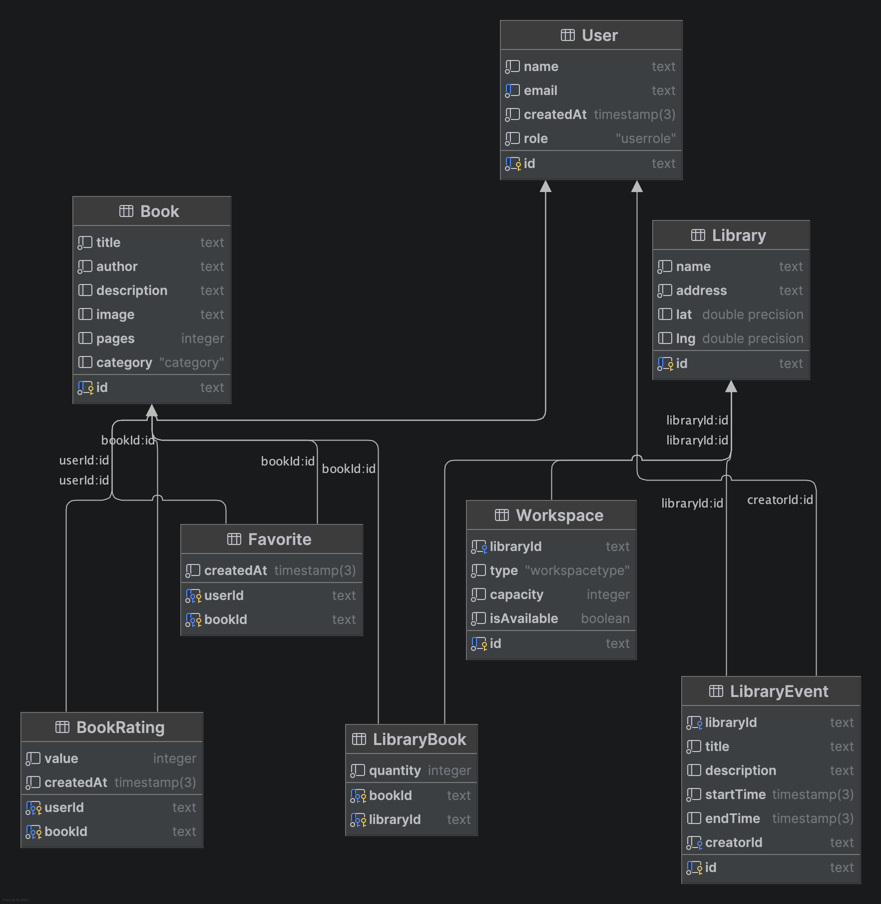

# ReadFinder - Онлайн-библиотека

**Автор:** Разгадов Даниил Павлович, M3310
**Email:** danya.razgadov@yandex.ru

## Описание

ReadFinder - это веб-приложение для поиска книг и библиотек, разработанное в рамках лабораторной работы по курсу "Backend-разработка".

## Доменная модель

### Описание предметной области

ReadFinder — сервис для поиска книг и библиотек. Пользователи могут просматривать каталог книг, добавлять их в избранное, искать библиотеки на карте, бронировать рабочие пространства и создавать мероприятия.

### Сущности

| Сущность | Описание | Ключевые атрибуты |
|----------|----------|-------------------|
| **User** | Пользователь системы (читатель) | id, name, email, role, createdAt |
| **Book** | Книга в каталоге | id, title, author, description, image, pages, category |
| **Library** | Библиотека с адресом и координатами | id, name, address, lat, lng |
| **Favorite** | Связь пользователя с избранной книгой (M:N) | userId, bookId, createdAt |
| **BookRating** | Оценка книги пользователем (M:N) | userId, bookId, value, createdAt |
| **LibraryBook** | Связь книги с библиотекой (M:N) | bookId, libraryId, quantity |
| **Workspace** | Рабочее пространство в библиотеке | id, libraryId, type, capacity, isAvailable |
| **LibraryEvent** | Мероприятие в библиотеке | id, libraryId, title, description, startTime, endTime, creatorId |

### ER-диаграмма

### Связи

- **User** 1 → * **Favorite** ← * **Book** — пользователь может добавлять много книг в избранное, книга может быть в избранном у многих пользователей
- **User** 1 → * **BookRating** ← * **Book** — пользователь ставит книге оценку от 0 до 10, у книги может быть много оценок
- **Book** 1 → * **LibraryBook** ← 1 **Library** — книга может быть доступна во многих библиотеках, в библиотеке есть много книг (с указанием количества экземпляров)
- **Library** 1 → * **Workspace** — в библиотеке может быть много рабочих пространств
- **Library** 1 → * **LibraryEvent** — в библиотеке может проводиться много мероприятий
- **User** 1 → * **LibraryEvent** — пользователь может создавать много мероприятий

## Деплой

Приложение развернуто на Render: https://readfinder-fullstack-yxbs.onrender.com

## Разработка

- `npm run build` — сборка приложения; `npm run lint` — проверка ESLint; `npm run format` — форматирование Prettier.
- `npm run prisma:gen` — генерация Prisma Client и DTO (`src/generated`, не хранится в git); выполняется автоматически в `postinstall`.
- Автотесты в рамках лабораторных не предусмотрены: скрипты `test`/`test:cov` соответствуют шаблону Nest, spec-файлы намеренно не добавлялись.
